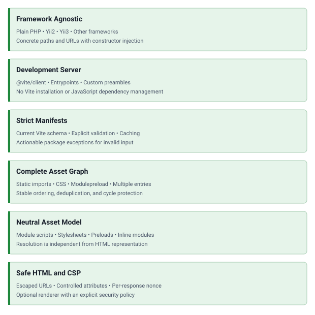

<!-- markdownlint-disable MD041 -->
<p align="center">
    <a href="https://github.com/php-forge/vite" target="_blank">
      
    </a>
    <h1 align="center">Vite</h1>
    <br>
</p>
<!-- markdownlint-enable MD041 -->

<p align="center">
    <a href="https://github.com/php-forge/vite/actions/workflows/build.yml" target="_blank">
        
    </a>
    <a href="https://dashboard.stryker-mutator.io/reports/github.com/php-forge/vite/main" target="_blank">
        
    </a>
    <a href="https://github.com/php-forge/vite/actions/workflows/ecs.yml" target="_blank">
        
    </a>
    <a href="https://github.com/php-forge/vite/actions/workflows/security.yml" target="_blank">
        
    </a>
</p>

<p align="center">
    <strong>A framework-agnostic PHP integration for resolving Vite development and production assets.</strong>
</p>

## Features

<picture>
    <source media="(min-width: 768px)" srcset="./docs/svgs/features.svg">
    
</picture>

## Installation

```bash
composer require php-forge/vite:^0.1
```

HTML output is generated with [`ui-awesome/html`](https://github.com/ui-awesome/html) while asset resolution remains
independent from its representation.

The consuming application owns Vite and every JavaScript dependency. Configure Vite to write a build manifest:

```js
import {defineConfig} from 'vite';

export default defineConfig({
    build: {
        manifest: true,
    },
});
```

## Quick start

### Development

```php
use PHPForge\Vite\Configuration\DevelopmentConfiguration;
use PHPForge\Vite\Html\HtmlRenderer;
use PHPForge\Vite\Vite;

$vite = new Vite(
    new DevelopmentConfiguration(
        devServerUrl: 'http://localhost:5173',
    ),
    entrypoints: ['resources/js/app.js'],
);

echo (new HtmlRenderer())->render($vite->resolve());
```

### Production

```php
use PHPForge\Vite\Configuration\ProductionConfiguration;
use PHPForge\Vite\Html\HtmlRenderer;
use PHPForge\Vite\Vite;

$vite = new Vite(
    new ProductionConfiguration(
        manifestPath: '/srv/app/public/build/.vite/manifest.json',
        assetBaseUrl: '/build',
    ),
    entrypoints: ['resources/js/app.js'],
);

echo (new HtmlRenderer())->render($vite->resolve());
```

## Documentation

- [Installation guide](docs/installation.md)
- [Configuration reference](docs/configuration.md)
- [Manifest resolution](docs/manifest.md)
- [Usage examples](docs/examples.md)
- [Security and CSP](docs/security.md)
- [Testing guide](docs/testing.md)

## Package information

[](https://www.php.net/releases/8.3/en.php)
[](https://packagist.org/packages/php-forge/vite)
[](https://packagist.org/packages/php-forge/vite)

## Code quality

[](https://codecov.io/gh/php-forge/vite)
[](https://github.com/php-forge/vite/actions/workflows/static.yml)
[](https://github.com/php-forge/vite/actions/workflows/quality.yml)
[](https://github.com/php-forge/vite/actions/workflows/dependency-check.yml)

## Social networks

[](https://x.com/Terabytesoftw)

## License

[](LICENSE)
