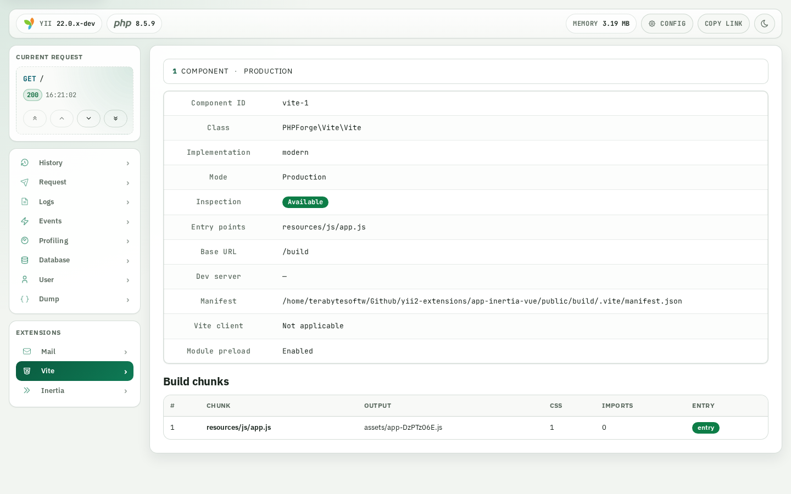

<!-- markdownlint-disable MD041 -->
<p align="center">
    <a href="https://github.com/php-forge/vite" target="_blank">
      
    </a>
    <h1 align="center">Vite</h1>
    <br>
</p>
<!-- markdownlint-enable MD041 -->

<p align="center">
    <a href="https://github.com/php-forge/vite/actions/workflows/build.yml" target="_blank">
        
    </a>
    <a href="https://dashboard.stryker-mutator.io/reports/github.com/php-forge/vite/main" target="_blank">
        
    </a>
    <a href="https://github.com/php-forge/vite/actions/workflows/ecs.yml" target="_blank">
        
    </a>
    <a href="https://github.com/php-forge/vite/actions/workflows/security.yml" target="_blank">
        
    </a>
</p>

<p align="center">
    <strong>A framework-agnostic PHP integration for resolving Vite development and production assets.</strong>
</p>

## Features

<picture>
    <source media="(min-width: 768px)" srcset="./docs/svgs/features.svg">
    
</picture>

## Installation

```bash
composer require php-forge/vite:^0.4
```

The consuming application owns Vite and every JavaScript dependency. Production resolution needs Vite's build
manifest; see [Installation](docs/installation.md) for the `vite.config.js` settings and the resulting manifest path.

## Quick start

### Development

```php
use PHPForge\Vite\Configuration\DevelopmentConfiguration;
use PHPForge\Vite\Html\HtmlRenderer;
use PHPForge\Vite\Vite;

$vite = Vite::create(
    DevelopmentConfiguration::create(
        devServerUrl: 'http://localhost:5173',
    ),
    entrypoints: ['resources/js/app.js'],
);

echo HtmlRenderer::create()->render($vite->resolve());
```

### Production

```php
use PHPForge\Vite\Configuration\ProductionConfiguration;
use PHPForge\Vite\Html\HtmlRenderer;
use PHPForge\Vite\Vite;

$vite = Vite::create(
    ProductionConfiguration::create(
        manifestPath: '/srv/app/public/build/.vite/manifest.json',
        assetBaseUrl: '/build',
    ),
    entrypoints: ['resources/js/app.js'],
);

echo HtmlRenderer::create()->render($vite->resolve());
```

## Debugger integration

`Vite::resolve()` emits `AssetsResolved` through an optional PSR-14 dispatcher. The asset resolution path never
imports a debug contract or calls a collector, so installing the package does not activate a debugger and a call
without a dispatcher emits no events. The collector and panel that do implement those contracts live apart, in
`PHPForge\Vite\Debug`, owned by this package.

See [Debugger integration](docs/debugging.md) for the Yii2 and Yii3 wiring. It remains an unreleased prototype.

<details>
<summary>Yii2</summary>
<picture>
    <source media="(prefers-color-scheme: dark)" srcset="docs/images/yii2-dark.png">
    <source media="(prefers-color-scheme: light)" srcset="docs/images/yii2-light.png">
    
</picture>
</details>

<details>
<summary>Yii3</summary>
<picture>
    <source media="(prefers-color-scheme: dark)" srcset="docs/images/yii3-dark.png">
    <source media="(prefers-color-scheme: light)" srcset="docs/images/yii3-light.png">
    
</picture>
</details>

## Documentation

- 📚 [Installation guide](docs/installation.md)
- ⚙️ [Configuration reference](docs/configuration.md)
- 🗂️ [Manifest resolution](docs/manifest.md)
- 💡 [Usage examples](docs/examples.md)
- 🛡️ [Security and CSP](docs/security.md)
- 🐞 [Debugger integration](docs/debugging.md)
- 🧪 [Testing guide](docs/testing.md)

## Package information

[](https://www.php.net/releases/8.3/en.php)
[](https://packagist.org/packages/php-forge/vite)
[](https://packagist.org/packages/php-forge/vite)

## Code quality

[](https://codecov.io/gh/php-forge/vite)
[](https://github.com/php-forge/vite/actions/workflows/static.yml)
[](https://github.com/php-forge/vite/actions/workflows/quality.yml)
[](https://github.styleci.io/repos/1342863441?branch=main)

## Social networks

[](https://x.com/Terabytesoftw)

## License

[](LICENSE)
